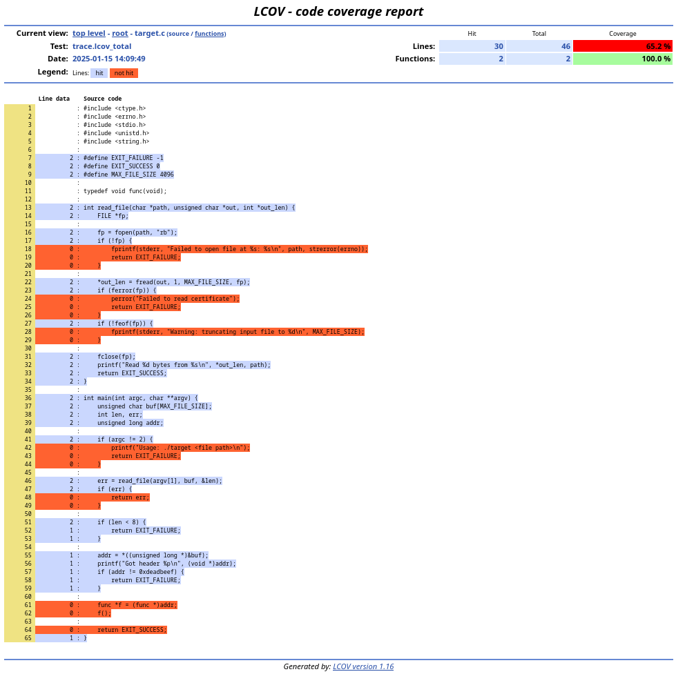

# Using afl-cov-fast on provided test targets

## Target

A very simple target used as a test for all supported backends is present in the
[tests directory](../tests). Its goal is to be easy to understand, having a bug
which might not be reached depending on coverage, and to work with all backends.

## Setup

Install the afl-cov-fast dependencies:

* Python 3 (tested with version 3.11.2);
* The Python `tqdm` package (tested with version 4.64.1);
* `lcov` / `genhtml` (tested with version 1.16);
* `llvm-profdata` (tested with version 14.0.6);
* `llvm-cov` (tested with version 14.0.6).

Clone and build AFL++:

```bash
git clone -b dev https://github.com/AFLplusplus/AFLplusplus.git
cd AFLplusplus
make distrib
```

**Note:** This was tested with commit `4086b93ad799e3cd28968102a2d175b166a31300` from Sep 9, 2024.

#### GCC

Build the target and run a fuzzing campaign for 120 seconds:

```bash
cd tests/gcc
make
./fuzz.sh -V 120
```

Generate the coverage information:

```bash
./cov.sh -j8
```

The coverage overview should be present in `output/cov/web/index.html`:


#### LLVM

Build the target and run a fuzzing campaign for 120 seconds:

```bash
cd tests/llvm
make
./fuzz.sh -V 120
```

Generate the coverage information:

```bash
./cov.sh -j8
```

The coverage overview should be present in `output/cov/web/index.html`:



#### QEMU

Build the target and run a fuzzing campaign for 120 seconds:

```bash
cd tests/qemu
make
./fuzz.sh -V 120
```

Generate the coverage information:

```bash
./cov.sh -j8
```

The coverage overview should be present in `output/cov/drcov/full.drcov.trace`:


#### Frida

Build the target and run a fuzzing campaign for 120 seconds:

```bash
cd tests/frida
make
./fuzz.sh -V 120
```

Generate the coverage information:

```bash
./cov.sh -j8
```

The coverage overview should be present in `output/cov/drcov/full.drcov.trace`:


