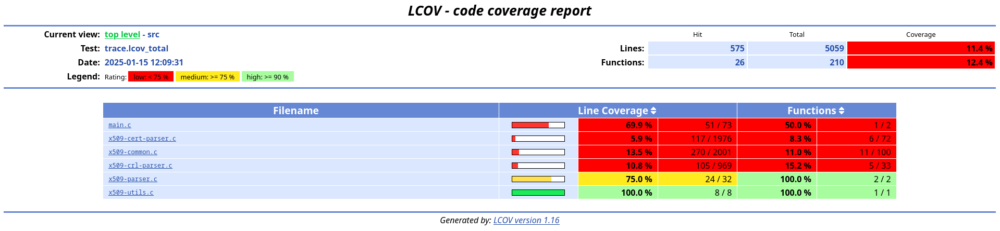
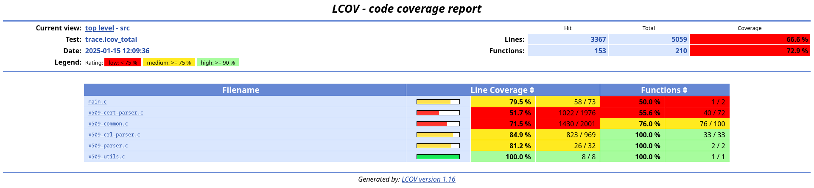

# Using afl-cov-fast with an x509 parser

## Target

The objectives is to test afl-cov-fast on a target fuzzing structure inputs to
observe whether the code is well covered or not. The
[x509-parser project from ANSSI](https://github.com/ANSSI-FR/x509-parser) was
chosen as it matches these requirements while being simple to fuzz with AFL++.

## Setup

Install the afl-cov-fast dependencies:

* Python 3 (tested with version 3.11.2);
* The Python `tqdm` package (tested with version 4.64.1);
* `lcov` / `genhtml` (tested with version 1.16).

Clone and build AFL++:

```bash
git clone -b dev https://github.com/AFLplusplus/AFLplusplus.git
cd AFLplusplus
make distrib
```

**Note:** This was tested with commit `7ad694716bf9772d8db5fbbe3f7aec4be99e61df` from Jan 13, 2025.

Clone the target project and build it with AFL++:

```bash
git clone https://github.com/ANSSI-FR/x509-parser.git
cd x509-parser
CC=../AFLplusplus/afl-gcc-fast make
```

**Note:** This was tested with commit `6f3bae3c52989180df6af46da1acb0329315b82a` from Oct 24, 2022.

## Corpus

Let's prepare two corpora: one with a dummy file, and another with various x509
certificates to observe if there are coverage differences.

### Dummy corpus

Create a single file with arbitrary content:

```bash
mkdir dummy_corpus
echo 'AAAAAAAAAAAAA' > dummy_corpus/a.txt
```

### Certificate corpus

We can reuse the dataset used by OpenSSL for fuzzing and regression tests:

```bash
git clone https://github.com/openssl/fuzz-corpora.git
mkdir cert_corpus
cp fuzz-corpora/*/* cert_corpus/
rm -rf fuzz-corpora
```

To improve efficiency, we can remove test cases which do not increase coverage:

```bash
../AFLplusplus/afl-cmin -i cert_corpus -o cert_corpus_unique -- ./build/x509-parser @@
```

## Fuzzing

Fuzz the target using each corpus for 300 seconds:

```bash
export AFL_SKIP_CPUFREQ=1
../AFLplusplus/afl-fuzz -i dummy_corpus -o dummy_output -V 300 -- ./build/x509-parser @@
../AFLplusplus/afl-fuzz -i cert_corpus_unique -o cert_output -V 300 -- ./build/x509-parser @@
```

## Compute coverage

Now that we have output directories from our fuzzing campaigns, rebuild the
target so that it outputs coverage information:

```bash
make clean
CFLAGS="--coverage -fPIC" make
```

Finally, run afl-cov-fast on both outputs to generate an overview of the
coverage:

```bash
../afl-cov-fast/afl-cov-fast.py -m gcc --code-dir . --afl-fuzzing-dir dummy_output --coverage-cmd 'build/x509-parser @@' -j8
../afl-cov-fast/afl-cov-fast.py -m gcc --code-dir . --afl-fuzzing-dir cert_output --coverage-cmd 'build/x509-parser @@' -j8
```

The coverage overview should be present in `dummy_output/cov/web/index.html`:



and in `cert_output/cov/web/index.html`:


